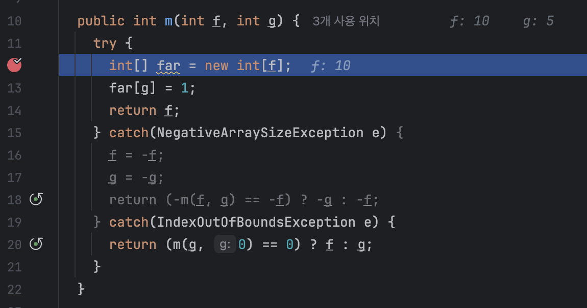

## 1.2 일반적인 코드 조사 시나리오
- 어떤 코드나 소프트웨어 기능이 왜 예상했던 것과 다른 결과를 내는지 이해한다.
- 디펜던시로 사용하는 기술이 어떻게 작동되는지 이해한다.
- 앱 속도 저하 같은 성능 이슈가 불거진 원인을 파악한다.
- 앱이 갑자기 중단된 원인을 찾아낸다.

이 책에서는 각 항목마다 유용한 조사 기법이 나올것이다.

### 예상과 다른 아웃풋의 원인을 밝힌다.
- 어떤 로직이 예상과 다른 결과가 나올때가 있다.

**아웃풋이란 뭘까?**
<br>
데이터를 변경하거나 정보를 주고받는 코드 로직의 실행결과. 또는 다른 컴포넌트나 시스템을 상대로 한 액션이다.

### 시나리오 1 : 단순 케이스
**조건**<br>
- DB에 레코드를 삽입하는 앱이 있다고 한다.
- 실행결과 이 앱은 레코드의 일부만 추가했다.
- 이 앱에서 생성한 레코드가 DB에 더 많이 있어야하는데, 실제로는 더 적은 레코드가 삽입됐다(실제 레코드)

이 시나리오는 가장 간단하다. 디버깅만 숙지되면 금방 잡을 수 있다. 
<br> 그러나 실제로 디버거만으로 퍼즐 조각을 맞추며 원인 발견하기는 어렵고 더 복잡한 경우가 많다.



디버거를 사용하면 실행되기 전에 잠깐 멈추고 하나씩 볼 수 있다.

### 시나리오 2 : 어디서부터 디버깅을 시작해야할까?
**조건** <br>
- 레코드가 DB에 올바르게 저장되지 않는 문제가 생겼다.
- 분명히 아웃풋이지만, 이 앱의 어디를 고쳐야할지 모르겠다.

**해결 하려면?**
- 프로파일러로 브레이크 포인트를 추가할 만한 코드 라인의 스코프를 좁혀가는것이다.

> 프로파일러는 앱이 실행되는 동안 어떤 코드가 실행되는지 식별하는 도구다.
<br>디버거로 어디서부터 조사를 시작해야 할지 영감을 주는 프로파일러가 적합한 옵션이다.<br>
프로파일러를 배우면 관찰하는것보다 더 많은 옵션이 있다는 사실을 알게된다.

### 시나리오 3 : 멀티스레드 앱
다중스레드, 즉 멀티스레드 아키텍처를 기반으로 한 로직을 처리할때는 골치가 더 아프다.
<br> 디버거 사용이 힘들기때문이다.

- 즉 디버거를 사용하는 시점마다 앱이 다르게 작동할 수 있다. 이런 특성을<br>
하이젠버그 실행, 또는 줄여서 하이젠 버그라고 사용한다. <br>
어떤 입자에 간섭을 일으키면 입자가 다른 행동을 해서 속도와 위치를 동시에 정확하게 측정은 힘들다는
<br>하이젠베르크의 불확정성 원리에서 유래된 명칭이다.

- 멀티 스레드 아키텍처는 시나리오가 너무 많아 테스트하기 힘들다.

### 시나리오 4 : 주어진 서비스에 잘못된 호출 보내기
다른 시스템의 컴포넌트나 외부 시스템과 올바르게 상호작용 하지못하는 시나리오도 있다.
- 이것은 잘못된 아웃풋의 일례다. 해결은 어떻게 할까?
- 이 부분은 디버거를 사용해서 앱이 어떻게 요청을 생성하는지 살펴본다.
- 어플이 어디를 쓰는지 모르면 프로파일러를 사용해서 찾아야할 수도 있다.

앱이 요청을 주고받는 위치를 정확히 모르겠다면, 다른앱을 스텁으로 변경해보는것도 좋다.<br>
가짜앱이라는거다. 스텁으로 요청을 차단시켜 앱이 응답을 무한 대기하도록 만들면
<br>코드의 어느 부분이 요청을 보내는지 알 수 있다.

그 다음 프로파일러로 어느 코드가 스텁 때문에 막혀있는지 찾아보는것이다.

### 특정 기술을 습득한다.
코드를 분석하는 조사 기법의 또 다른 용도는 특정 기술의 작동 원리를 배우는것이다.

- 가령 스프링 시큘리티는 언뜻 보면 별거 아닌것 같다. 인증과 권한부여를 구현한 라이브러리일 뿐이다.
- 이 두 기능을 앱에 구성하는 방법이 얼마나 다양한지 깨닫기 전에는 그렇게 보일 수 있다.
- 잘못 조합하면 곧 바로 문제가 발생한다. 최선의 방법은 시큘리티 내부를 보는것이다.

> 결론은 무엇을 배우든지, 코드를 검토하는 시간에 아낌없이 투자하라는점이다.

### 속도 저하 이유를 알아낸다.
앱에서 가장 흔히 발생하는 문제는 앱의 응답 속도와 연관되어있다.<br>
대부분 개발자는 속도 저하와 성능을 동일시 하는 경향이 있는데, 실은 그렇지 않다.

- 특별한 이유없이 열린 상태로 실행되면서 성능 및 메모리 이슈를 일으키는 스레드를 **좀비스레드**라고 한다.
- 많은 경우 속도 저하는 파일이나, DB에서 읽기 쓰기를 하거나, 데이터를 전송하는등의 I/O호출하는 과정에서 발생한다.
- 경험으로 대략 문제를 찾아내도, 정확한 위치를 알려면 도구가 필요하다.

### 앱 크래시가 발생하는 이유를 이해한다.
로컬에서는 앱 크래시를 재현하기 어려워 까다롭다. 앱 크래시는 두가지 형태로 나타난다.
- 앱이 완전히 멈춘다.
- 실행은 계속 되지만 요청에 응답하지않는다.

대부분 힙 메모리 문제다. 힙 메모리 문제를 해결하려면 **힙 덤프**를 사용해야한다.

```java
public static void main(String[] args) {
    while (true) {
      products.add(new Product(UUID.randomUUID().toString()));
    }
  }
```

OMM에러가 발생하는 코드다.
- 힙 덤프는 힙 메모리의 지도 같은것이다, 힘 덤프는 메모리나 성능 문제를 조사할 때 큰 도움이 된다.
- 앱은 계속 실행되지만 응답이 없는경우, 스레드 덤프는 안에서 무슨 일이 일어나고 있는지 분석하는 최상의 도구다.