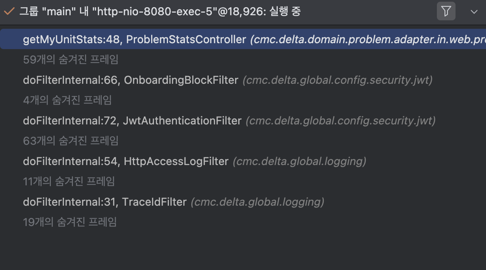

## 2.2 디버거를 이용한 코드 조사
- 보통 디버거는 거의 모든 IDE에서 기본으로 제공된다.
- 특정 스텝에서 잠깜 실행을 멈추고 각 커맨드를 본인 페이스에 맞게 실행할 수 있다.

> 디버거를 언제 사용해야 할지는 어떻게 알 수 있을까?  
아마 지금쯤 그런 생각이 들것이다. 여기서 핵심 전제는 지금 내가 조사하려는 로직이 무엇인가? 아는것이다. 
디버거를 사용하는 첫 단계가 바로 실행을 중단 시켜야 할 커맨드를 선택하는 일이기 때문이다.

- 다양한 기법을 사용해서 디버거로 조사하려는 코드 부위를 찾는 작업이 선행되어야한다.
- 불분명한곳을 찾아냈다면, 앱을 실행하고 그 위체에서 실행을 멈추도록 디버거에게 지시한다.

**앱 실행을 중단시킬 위치는 브레이크포인트를 찍어 표시한다**

- 브레이크 포인트는 중단시킬 코드라인에 마커를 칠하고, 브레이크 포인트를 만나면 코드가 멈춘다.

var 키워드를 사용해서 로컬 변수를 타입추론 할 수도 있다.  
변수 타입 추론은 코드를 더욱 읽기 어렵게 만들 소지가 있어서 항상 옳은 선택이라고 할 수 는 없다. 
반대로 생각해보면 이런 부분을 디버거로 들여다볼때 무척 유용하다는 느낌이 든다.

> 디버거로 코드를 조사할 때는 이해할 수 없는 코드의 첫라인부터 시작해라.

- 먼저 코드를 읽고 이해할 수 있는지 확인하는 편이 효과적이다.  
그 다음에 문제가 되는 지점부터 바로 디버깅해라.

**스코프 내 모든 변숫값:** 모든 변수와 그 값을 알면 지금 어떤 데이터를 처리중인지 어떤 영향을 미치는지 알 수 있다. 
**실행 스택 트레이스:** 디버거가 실행을 중단시킨 라인에서 앱이 이 코드 라인을 어떻게 실행한지 나타낸다. 
호출 체인에 묶인 메서드들이다. 조사하면 코드 탐색시 특정 커맨드에 어떻게 도달했는지 한눈에 볼 수 있다.

브레이크 포인트를 원하는만큼 몇개씩 추가할 수 있지만, 한번에 3개 이상 찍지 않는다. 
너무 많이 찍었다가, 본인도 잊어버려서 코드를 헤매는 개발자를 많이 봐왔기때문이다.

### 2.2.1 실행 스택 트레이스란 무엇이고 어떻게 사용해야할까?

개발자는 대게 어떤 메서드가 호출 됐는지 이해하려고 실행 스택 트레이스를 이용한다.
  이런 로직을 직접 눈으로 관찰하기는 어렵다.

- 실행 스택은 맨 아래에서 맨 위 방향으로 읽는다. 맨 아래 레이어가 바로 실행이 시작된 첫 번째 레이어다. 
맨 위 레이어가 중단 시킨 원인이다. 멈춘다면 말이다.
- Aspect 같은 로직은 파악하기 어렵다. 완전히 디커플링 되어있어서 숨겨져있다.

### 2.2.2 디버거로 코드 탐색하기
디버거로 코드를 탐색하는 세가지 기본 기술이다.

- 스텝 오버: 동일한 메서드에서 다음 코드라인으로 계속 실행한다.
- 스텝 인투: 현재 라인에서 호출된 메서드 중 하나의 내부에서 계속 실행한다.
- 스텝 아웃: 조사하던 메서드를 호출한 메서드로 실행을 되돌린다.

**코드가 나중에는 많아지니, 키보드 단축키로 쓰는 습관을 들이지**

- 코드의 방식을 알고싶다면, 일단 스텝 오버로 시작하는것이 좋다. 
스텝 인투를 할 때마다 조사 플랜이 새로 열리면 더 복잡해진다. 대부분 스텝오버하며 아웃풋을 관찰하는 것만으로도 대략 어떤일을 하는지 짐작할 수 있다.

- 스텝 인투를 더 깊이 할수록 조사에 시간이 점점 더 많이 들것이다.

1. 메서드를 읽고 이해 안되는 코드의 첫라인을 찍는다.
2. 해당 코드 라인에 브레이크 포인트를 찍고 거기서부터 조사를 시작한다.

- 다음 실행 라인이 항상 다음 라인이 아닐 수 있다. 12번째 라인에서 예외 발생시 18번째 라인이 되는것이다.
