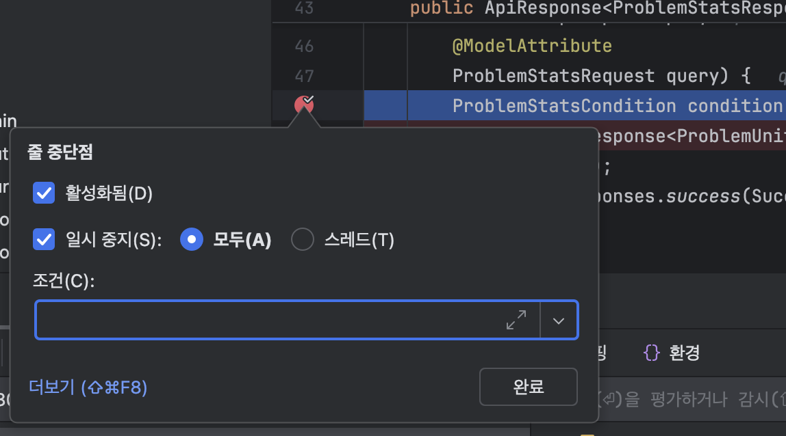

## 3.1 조건부 브레이크 포인트로 조사 시간 최소화
조건부 브레이크포인트는 특정한 조건을 만족할 경우 앱 실행을 중단시키는 방법이다.

- 코드를 디버깅할 때는 어떤 값에 대해 코드 로직이 어떻게 작동되는지만 관심을 두는 일이 흔하다.
 또는 단순히 특정한 상황에서 코드가 어떻게 실행되는지 이해함으로써 전체적인 기능을 더 잘 알고싶은 경우도 있다.

- 실무에서 원하는 케이스가 언제 나타나는지 알 수 없는 상황에서 운좋게 케이스에 도달까지 스텝 오버를 계속할 수 있을까?
- 조건부 브레이크 포인트를 사용하면 효율적으로 코드를 쓸 수 있다. 
브레이크 포인트에서 마우스 오른쪽을 클릭하고 브레이크 적용할 조건문을 입력한다.

조건을 추가하여 조건을 만족할경우 멈추게 할 수 있다.
- 이렇게 간단한데, 잘 몰라 시간을 허비하는 개발자가 매우 많다.
- 단점도 있다. 변숫값을 디버거가 지속적으로 가로채서 브레이크 포인트 조건을 평가해야 하므로 실행 성능에 상당히 큰 영향을 미친다.
- 또 다른용도는, 스텍 트레이스등의 세부 정보를 기록하는 것이다.