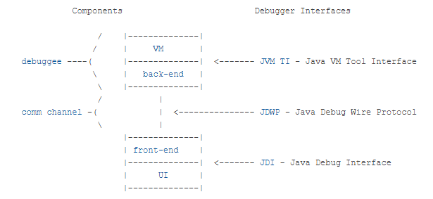

## 4.1 원격 디버깅이란?
이 장에서는 원격 디버깅을 언제 사용하고 사용하지 말아야할지에 대해 배운다.

### 앱을 개발할 땐, 환경을 고려해야한다.
- 개발 환경
    - 앱을 배포할 환경과 유사한 환경이다. 개발자는 주로 로컬 시스템에서 개발 진행을 하고 이 환경에서 새로운 기능과 수정 사항을 테스트한다.

- 사용자 인수 테스트 환경
    - 개발 환경에서 테스트를 마친 앱은 사용자 인수 테스트 환경에 설치 
    새로운 구현체와 수정 코드를 실험, 정상 작동 확인

- 프로덕션 환경
    - 새로운 구현체가 잘 작동되는지, 앱을 설치한다.

**내 컴퓨터에서는 되지만, 상대방의 컴퓨터에서 안된다면?** 
이런 일이 정말 많을텐데, 이유는 몇가지 있다.

1. 설치된 운영체제가 다르다.
2. 리소스가 환경마다 다르다.
3. 퍼미션 설정이 다르다.

이외에도 동작을 달라지게 만들 수 있는 요인은 정말 많다.

> 원격 디버깅은, 같은 상황에서 소프트웨어 동작을 더 빨리 이해하는 데 큰 도움이 될 수 있다.
 그러나 한가지는 명심하자, 프로덕션 환경에서는 사용하면 안된다. 다양한 환경에서 차이점을 명확히 이해하자.

원격 디버깅을 하려면, 앱을 실행할 때 에이전트라는 소프트웨어를 앱에 꼭 부착해야한다. 에이전트를 붙이지 않으면
 여러가지 상황에서 기능적이나, 실행시에 오류를 일으킬 수 있다.

