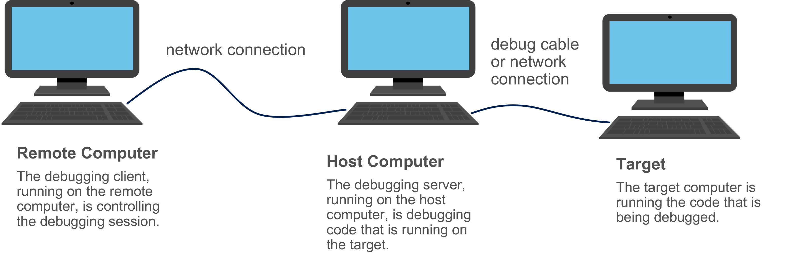

## 원격 앱 디버깅
성능 이슈는 DB  접속 또는 파일 읽기/쓰기등의 I/O인터페이스가 원인으로 지목되고는 한다.
 어떤 앱의 성능 저하의 확인 결과 랜덤값, DB에 저장된 UUID의 단순 생성이 성능 이슈의 원인으로 밝혀졌다. 

- 운영체제는 하드웨어 소스를 사용해 **엔트로피라는 랜덤성을 수집**하고, 앱은 이 랜덤성을 이용해 랜덤값을 사용한다.
 그러나 가상머신이나 컨테이너 같은 가상화 환경에 이 엔트로피를 만들어낼 소스가 적다. 랜덤값 생성하기 충분한 엔트로피가 없던것이다. 
이 상황에서는 보안 이슈가 생길 수 있다.

- 내 컴퓨터에만 문제가 없으면 없는것일까? 아니다. 원격 디버깅을 실행할만하다. 이 장에서는 원격 디버깅에 대해 알아본다.

1. 다른 시스템 앱에 접속해 원격 디버깅을 해도 개발자의 로컬에서 돌아간다.
2. 로컬에 있는 디버거로 전혀 다른 환경에 연결하면 특정 환경에서만 일어나는 문제를 알아낼 수 있다.

