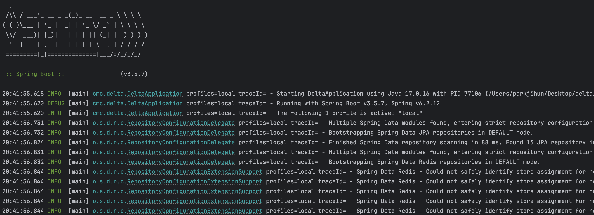

## 로그를 활용하여 앱 동작 감시하기

이 장의 주제는 앱이 기록한 로그 메시지의 사용법이다. 
항해사들도 전부 항해일지를 기록하듯, 개발자도 나중에 문제가 일어날 부분을 검토하거나 보안 취약점을 발견하는데 도움이 된다.

로컬 IDE에서 앱을 실행하면 콘솔에서 확인할 수 있다.

보기 편한 로그를 남기려면 앞으로 이 장에서 설명할 몇가지 베스트 프랙티스를 따르는게 좋다.

- 타임 스탬프
    - 앱이 메시지를 기록한 시점, 시간순으로 정렬 시 기준 정보

- 심각도
    - 메시지의 중요도, 로그레벨이다.

- 메시지
    - 무슨 일이 일어났는지 사람이 쉽게 읽고 이해할 수 있도록 기술

- 위치
    - 앱이 어느 부분에서 이벤트를 발생시켰는지, 모듈과 클래스는 표시하는것이 보통이다.

개발자는 보통 로그확인을 기본적으로 해야한다. 이상한 동작이 바로 보이기때문에 어디서부터 조사를 시작해야할 지  
정확하게 진단할 수 있기 때문이다.

- 로그를 읽고 디버깅을 할지 프로파일링을 할지 정해야한다. 힌트를 먼저 얻어야한다.

