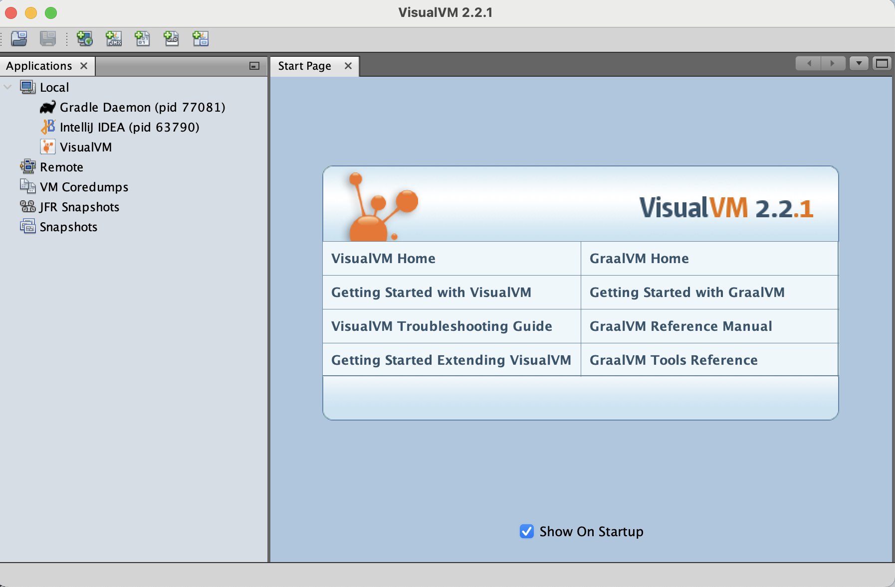
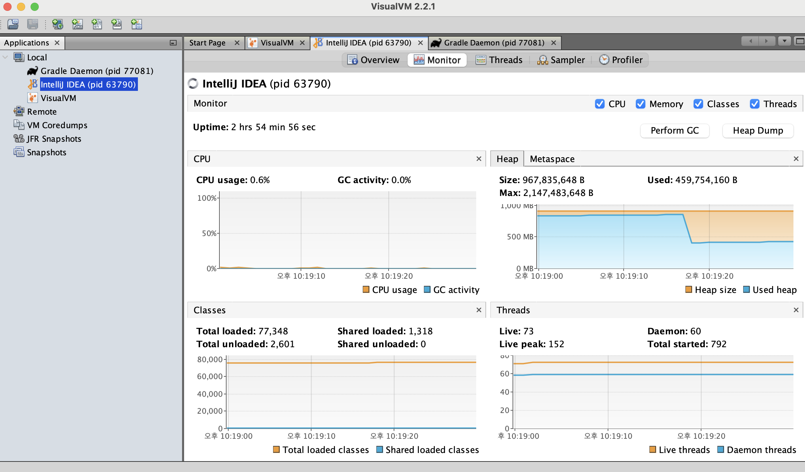
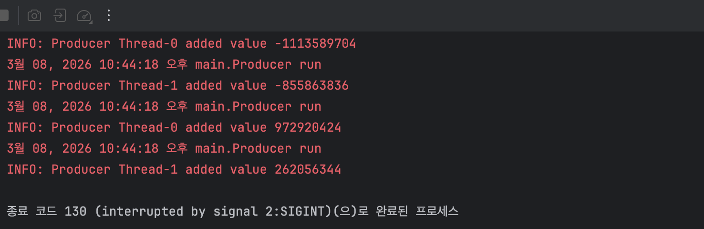
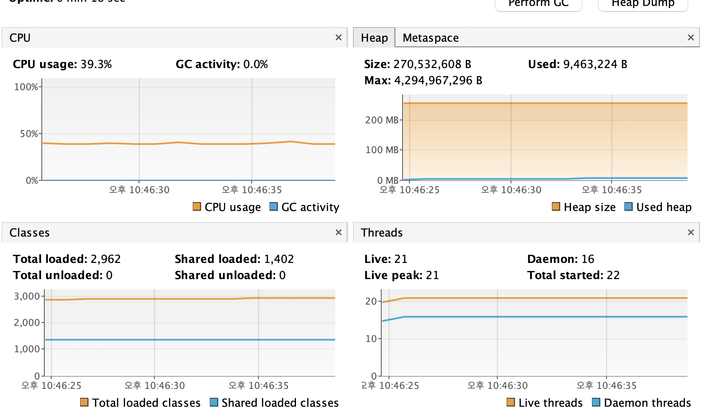
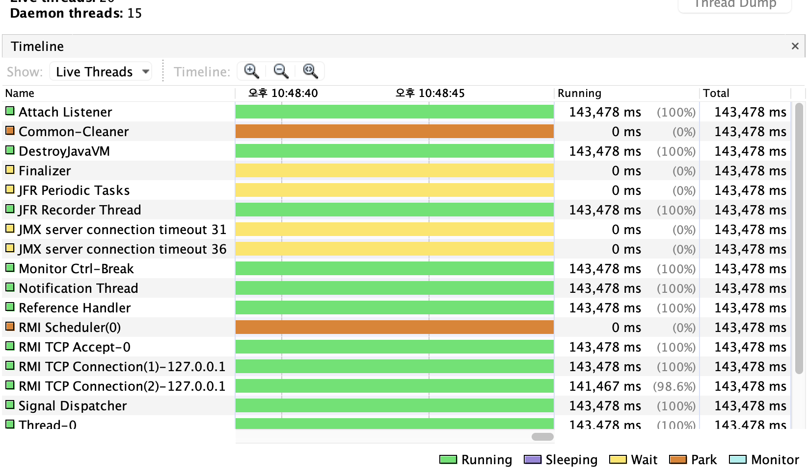
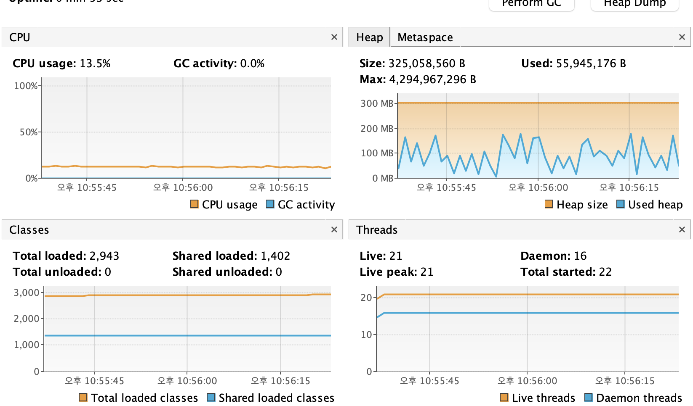
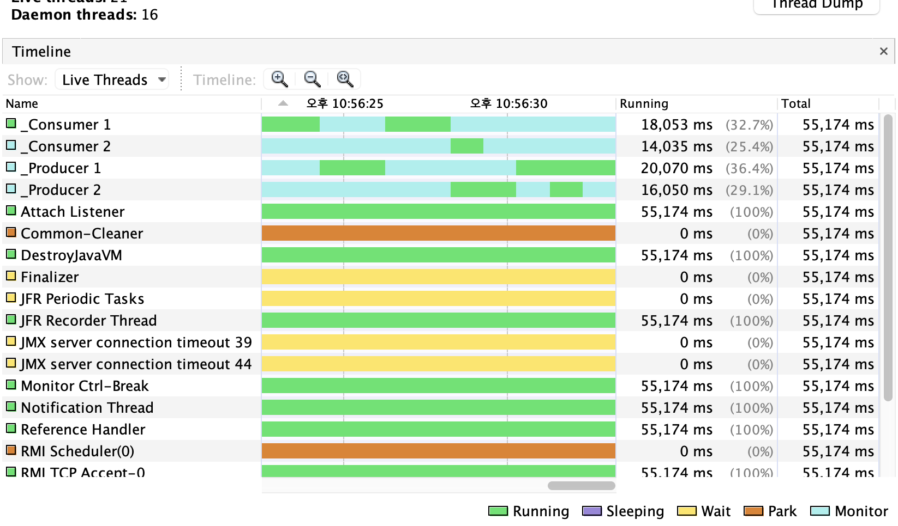
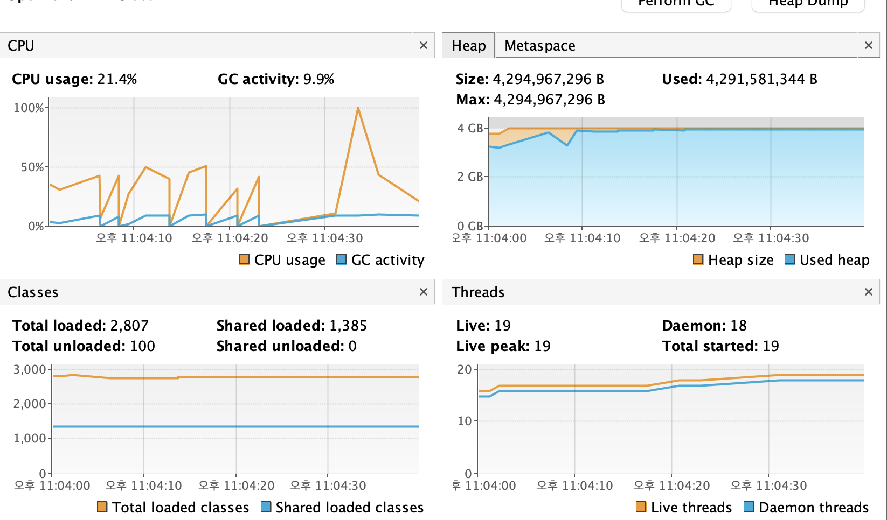
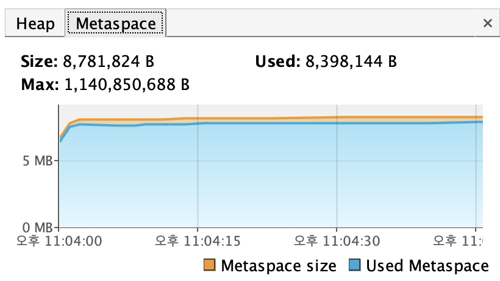

## 프로파일러 사용법

visualVM 설치 및 구성 설치는 정말 간단하다. 
<br>검색시에 그냥 나오는데, 그것을 설치해주면 된다.

 

실행할 경우 이렇게 나오게된다.자바 8이상의 버전이 필요하다. 기본적으로 이렇게 생성된다.



여기서 jvm지원 불가가 나오거나, 에러 메시지가 나올경우, 무언가 잘못 설정된것이다.

### CPU와 메모리 사용량 관찰
프로파일러로 할 수 있는 가장 간단한 작업은, 앱이 시스템 리소스를 사용하는 모습을 관찰하는것이다.

**메모리 누수**
- 앱이 불필요한 데이터를 메모리에서 해제하지 않는 현상이다. 시간이 지나면 가용 메모리가 고갈되어 심각한 문제가 생긴다.

실행중인 앱을 들여다보면, 비정상적인 앱 동작을 쉽게 발견할 수 있다. <br>
앱 실행이 끝난뒤에도 리소스를 차지하는 좀비스레드는 visualVM에서 바로 드러낸다. 어떻게 찾아낼까?

```java
public class Producer extends Thread {

  private Logger log = Logger.getLogger(Producer.class.getName());

  @Override
  public void run() {
    Random r = new Random();
    while (true) {
      if (Main.list.size() < 100) {
        int x = r.nextInt();
        Main.list.add(x);
        log.info("Producer " + Thread.currentThread().getName() + " added value " + x);
      }
    }
  }

}
```
이 코드는 리스트에 추가 가능한 최대 개수를 지정한다.
<br>리스트에 랜덤값을 추가한다.

```java
public class Consumer extends Thread {

  private Logger log = Logger.getLogger(Consumer.class.getName());

  @Override
  public void run() {
    while (true) {
      if (Main.list.size() > 0) {
        int x = Main.list.get(0);
        Main.list.remove(0);
        log.info("Consumer " + Thread.currentThread().getName() + " removed value " + x);
      }
    }
  }
}

```
컨슈머 스레드는 리스트에서 값을 삭제한다.
<br>Main 클래스는 프로듀서 스레드 2개, 컨슈머 스레드 2개를 각각 생성한다.

```java
public class Main {

  public static List<Integer> list = new ArrayList<>();

  public static void main(String[] args) {
    new Producer().start();
    new Producer().start();
    new Consumer().start();
    new Consumer().start();
  }
}
```
프로듀서 및 컨슈머 스레드를 만들어 시작하는 Main클래스, 근데 이 앱에서는 프로그램을 잘못 작성했다.
<br>다수의 스레드가 ArrayList타입의 리스트에 동시에 달려들어 변경을 일으키지만, 자바 ArrayList는 동시성 컬렉션 구현체가 아니다.
<br>따라서 여러 스레드가 이 컬렉션에 액세스 하면 경쟁상태에 빠질 공산이 크다. 경쟁 상태는 이렇게 여러 스레드가 동일한 리소스에 서로 다투어
<br>액세스 하려고 할 때 발생한다.

- 이 앱에서는 스레드 동기화 기능이 빠졌다. 그래서 어떤 스레드는 경쟁상태에 빠져 예외 발생하고, 영원히 살아남아 아무일도 하지않는다<br>
다음 코드를 살펴보자.

먼저 이 코드는 실행하게 되면 코드가 멈춘다.


- 앱이 중단된것 처럼 보이지만, 아니다.
1. CPU의 사용량을 확인한다.
2. 프로세스의 메모리 사용량을 확인한다.
3. 실행중인 스레드를 시각화 한다.



CPU를 보니, 40이나 잡아먹으며, GC가 전체 CPU사용량에서 차지하는 비중이 없다는 사실이 흥미롭다.<br>
이는 일반적으로 동시성 문제로 발생하는 좀비 스레드를 나타내는 이상 징후에 해당한다.

- 컨슈머 프로듀서 스레드가 제대로 일을 못하지만 리소스를 소모하는듯 하다.
- 여러 스레드가 비동시성 컬렉션에 액세스하여 변경을 시도하다 보니 경쟁상태가 발생했기 때문이다.

우리는 이미 앱이 잘못됐다는 사실을 알지만, 이런 증상으로 나중에 실마리를 잡을 수 있다.

이 예제는 GC가 CPU를 전혀 사용하지않는다. 앱이 많은 처리 능력을 소비하면서도 실제로 아무것도 처리하지않는다는 뜻이다.
<br>일반적으로 좀비 스레드를 나타내는 징후로서 동시성 문제가 생긴 결과다.

오른쪽 메모리를 보면 CPU는 40이나 사용중이지만, 메모리는 거의 사용하지않는다. 



- 앱이 아무것도 하지않는것 같지만, 스레드는 전부 실행중이다. 이들은 그저 CPU리소스를 축 낼 뿐이다.
- 컨슈머와 액세스를 동기화 시켜보자.

```java
public class Consumer extends Thread {

  private Logger log = Logger.getLogger(Consumer.class.getName());

  public Consumer(String name) {
    super(name);
  }

  @Override
  public void run() {
    while (true) {
      synchronized (Main.list) {
        if (Main.list.size() > 0) {
          int x = Main.list.get(0);
          Main.list.remove(0);
          log.info("Consumer " + Thread.currentThread().getName() + " removed value " + x);
        }
      }
    }
  }
}

```

- List인스턴스를 스레드 모니터로 사용하여 리스트에 대한 액세스를 동기화한다.

```java
public class Producer extends Thread {

  private Logger log = Logger.getLogger(Producer.class.getName());

  public Producer(String name) {
    super(name);
  }

  @Override
  public void run() {
    Random r = new Random();
    while (true) {
      synchronized (Main.list) {
        if (Main.list.size() < 100) {
          int x = r.nextInt();
          Main.list.add(x);
          log.info("Producer " + Thread.currentThread().getName() + " added value " + x);
        }
      }
    }
  }

}

```
- 프로듀서도 동일하게 해준다. 또한 스레드마다 이름을 부여했다. 전에는 0 1 2 로 했는데 이는 별 도움이 안된다.super() 생성자에 스레드명을 전달했다.

```java

public class Main {

  public static List<Integer> list = new ArrayList<>();

  public static void main(String[] args) {
    new Producer("_Producer 1").start();
    new Producer("_Producer 2").start();
    new Consumer("_Consumer 1").start();
    new Consumer("_Consumer 2").start();
  }
}

```
앱을 시작하면 콘솔에 로그 표시되는데 처음 앱처럼 중단되지않는다. 스레드를 연속적으로 실행되지않기 때문에 CPU는 낮은편이다.




- 코드를 올바르게 동기화하면 CPU 소비는 줄고 앱은 메모리를 약간 사용하는 형태로 리소스 소비 패턴이 달라진다.

### 메모리 누수 현상 식별
**메모리 누수**는 앱이 사용하지 않는 객체 레퍼런스가 메모리에 계속 남아 있는 현상을 말한다.
<br>앱이 할당받은 메모리에서 불필요한 데이터를 비우는 GC도 이런 레퍼런스가 남아있어서 삭제할 수 없다.<br>
점점 많은 데이터가 쌓이면 결국 메모리는 가득차고, 더이상 새 데이터를 추가할 공간이 없으면 OOM에러가 나서 중단된다.

1. 객체 인스턴스를 생성하여 그 레퍼런스를 리스트에 보관하는 앱이 있다고 가정한다.
2. 앱은 새로운 인스턴스를 계속 찍어낸다. 사실 필요 없는데 리스트에서 지우지도 않는다.
3. 앱이 계속 레퍼런스를 찾기때문에 GC는 메모리에서 삭제하지 못하고, 앱이 더 이상 객체를 할당할 수 없는 지경에 이르면 프로세스가 중단되고 앱은 OOM에러를 내며 실패한다.

- ex3는 간단한 에러 OOM에러를 나타낸다. 리스트에 저장하지만 삭제하지않는다.

```java
public class Cat {

  private int age;

  public Cat(int age) {
    this.age = age;
  }

  public int getAge() {
    return age;
  }

  public void setAge(int age) {
    this.age = age;
  }
}

```
```java
public class Main {

  public static List<Cat> list = new ArrayList<>();

  public static void main(String[] args) {
    while(true) {
      list.add(new Cat(new Random().nextInt(10)));
    }
  }
}

```
- 리소스 사용량을 살펴보자, 메모리 사용량이 계속 증가하는것을 보여준다. 메모리를 비우려고 애쓰지만 턱없이 적다. 결국 소진되고 OOM에러가 발생한다.



- 여기서도 OOM에러 스택 트레이스에서 나오는 클래스는 주요 원인이 아닐 수 있다는 점을 항상 생각해라.
- 자바 앱에 할당되는 힙 크기는 조정할 수 있다. JVM이 최대 크기까지 메모리를 앱에 할당할 수 있다.
<br>메모리를 더 많이 할당한다고 누수가 해결되는것은 아니지만, 근본 원인을 찾는 시간을 조금 더 벌 수 있는 임시방편은 될 수 있다.<br>
최대 힙 크기는 JVM 애트리뷰트 -Xmx 다음에 할당 할 메모리를 입력한다. 마찬가지로 -Xmx 애트리뷰트를 사용하면 최소 초기 힙 크기를 설정할 수 있다.

### 정상 Heap메모리


### 비정상 Heap메모리


- 힙 공간 외에도 모든 자바 앱은 메타스페이스를 이용한다. 메타스페이스 할당량은 VisualVM의 메모리 할당 위젯의 Metaspace탭에서 확인 된다.
<br>메타 공간에서 OOM에러가 발생하는 일은 드물지만 불가능하지는 않다. 


메타 스페이스 크기와 사용량은 Metaspace에서 표시된다. 메타 데이터를 저장하는 메모리 공간이다. 이 공간마저 가득찰 수 있다.
- 필요시 대체 퍼시스턴스 기술을 사용하여 리팩토링 할 수 있다.