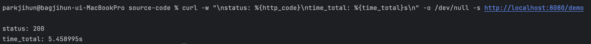
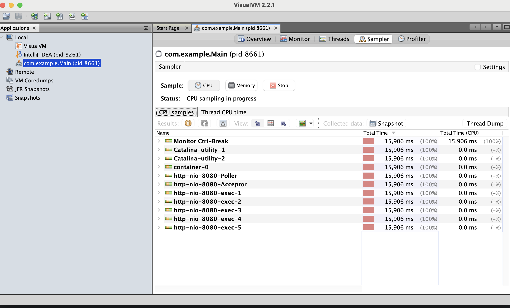
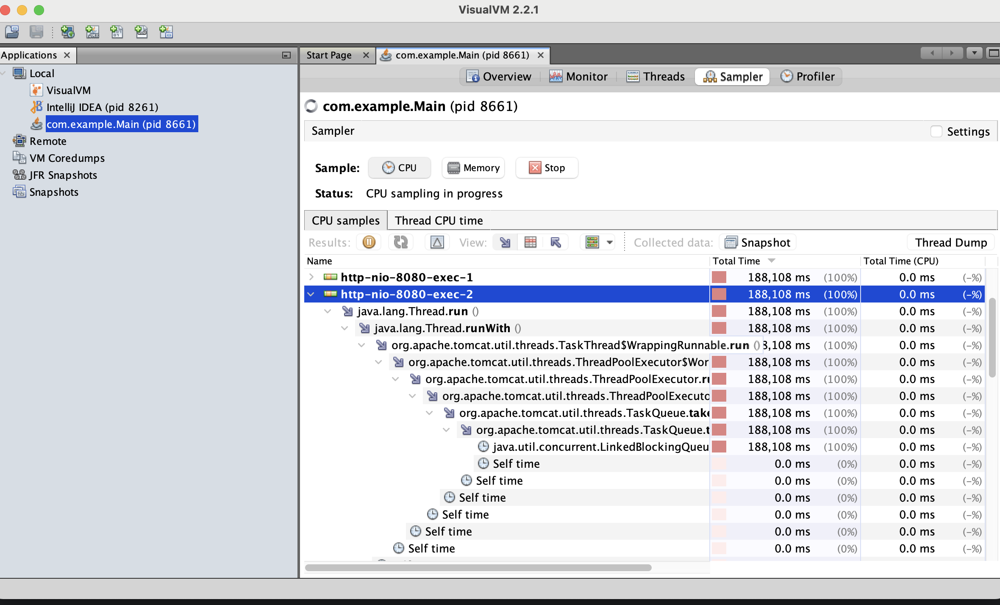
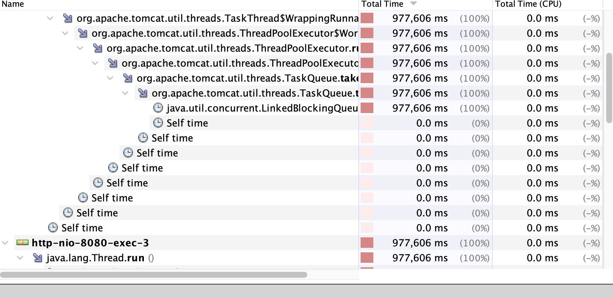

## 7.1 샘플링으로 실행되는 코드 관찰
- 샘플링은 프로파일러로 앱이 실행하는 코드를 찾아내는 방법이다. 
- 어떤 일이 일어나고 있는지 큰 그림을 그려보고 추가 분석에 필요한 정보를 제공한다.
- 샘플링은 항상 앱 프로파일링의 첫 단계로 활용하는 것이 좋다, 사실 **샘플링만으로도 충분한 경우가 많다.**

**da-ch7-exl 프로젝트를 컴파일 할것이다.**

여기서는 앱에서 지연이 발생하고 있는 상황을 시뮬레이션할 목적으로 응답을 5초동안 늦게 하도록 설정되었다.

시나리오는 다음과 같다.
1. cURL 또는 포스트맨으로 앱에 구현된 /demo 엔드포인트를 호출한다.
2. 앱은 다시 httpbin.org에 있는 엔드포인트를 호출한다. 응답 시간은 5초인데 너무 오래걸린다.
3. /demo 엔드포인트의 실행 시간이 왜이렇게 오래걸리는지 모른다고 가정을 하자.

- 샘플링을 통해 어떤 코드가 실행되는지 파악하고 어느 부분을 좀 더 자세히 들여다봐야 하는지 알아낸다.
- 프로파일링을 통해 특정 코드의 실행에 관한 상세 정보를 얻는다.

> 1단계만으로도 충분하여 2단계까지 안가는 경우도 많다. 속도가 왜 느린지,
<br>본인도 잘 모르겠으면, 프로파일링을 가장 먼저 떠올리자.



코드를 실행하면 5초가 걸린다. 매우 느리다. 나는 1초대로 단축해야겠다.



샘플링을 눌러보자, CPU를 누르면, 스레드를 VisualVM이 가로채기 시작한다.<br>
실행중인 스레드는 이 리스트에 나열된다. 작은 [+] 버튼을 클릭하면 스레드별 실행 스택이 아래로 펼쳐진다.

> 샘플링의 목적은 세가지다. 
- 어떤 코드가 실행되는지 알아낸다.
- CPU 사용량 파악하기.
- 메모리 소비량 파악하기.

샘플링을 실행하면 스레드 실행 스택을 펼쳐보면 스레드가 대여섯 개 나 나타날것이다.엔드포인트 호출시 앱에서 생성되어 시작된 스레드들이다.



하나씩 열어보면 무엇을 하는지 알 수 있다.
- 이 예제처럼 레이턴시의 원인을 조사할 때에는 스택 트레이스를 펼쳐서 최대 실행 시간을 확인하면 된다.
- 여기서 주목할 건, CPU의 시간이 모두 0.0ms라는 점이다. 5초라는 시간이나 썼지만, HTTP호출을 하고 응답만 했기에
<br> CPU리소스를 전혀 사용하지않았다.

여기서 우리는 HTTP요청을 보내고 응답을 기다리는 과정에서 느려졌다는 결론을 내릴 수 있다.

우리는 CPU의 시간과 총 실행 시간을 명확하게 구분해야 한다. 어떤 메서드가 CPU시간을 소비한다는건 그 메서드가 작동된다 라는 뜻이다.
<br>이러한 경우 성능을 개선하려면, 복잡도를 최소화하는 방향으로 알고리즘을 조정해야한다.

- CPU 시간은 거의 안쓰는데, 메서드 실행 시간이 긴 경우에는 메서드가 무언가 기다리고 있다는것이다. 아무일도 하지않는데, 앱이 무엇을 기다리는지 알아야한다.
- 한가지 더!, 프로파일러가 앱의 코드 베이스만 가로채는 것이 아니라는 점도 유념하길 바란다.

예제는 오픈페인이라는 디펜던시로 httpbin.org의 엔드포인트를 호출한다. 스택 트레이스에서 앱의 코드베이스가 아닌 패키지는 십중팔구 디펜던시의 일부다.
오픈페인도 그중 하나다.

오픈페인은 스프링 앱에서 REST 엔드포인트를 호출하는 용도로 많이 쓰는 라이브러리다.



- 앱을 구현한 코드뿐만 아니라 앱에서 사용된 프레임워크, 라이브러리에 있는 코드까지 모두 가로챈다.
- java.util.concurrent.LinkedBlockingQueue.take 나같은 경우는 여기서 끝이났는데 이게 다 먹고있던것이다.
- 오늘날 많은 자바 프레임워크에서 디펜던시는 다이내믹 프록시를 사용해서 구현체를 디커플링하기 때문에 발생한다.

```java
@FeignClient(name = "httpBin", url = "${httpBinUrl}")
public interface DemoProxy {

  @PostMapping("/delay/{n}")
  void delay(@PathVariable int n);
}
```
위의 예제는 오픈페인을 사용한 HTTP 클라이언트 코드이다.

**다이내믹 프록시**는 런타임에 메서드 구현체를 갈아 끼울 수 있는 수단이다. 덕분에 어떤 구현체를 쓸 지 몰라도, 인터페이스에 선언한 메서드를 호출하면된다.
<br>프레임워크의 기능을 빌려쓰는것은 쉬워도 문제가 생기면 어디서부터 조사해야할지, 막막해진다.

새로운 프레임워크나 라이브러리를 배울때 샘플링을 사용하면 좋다. 어떤 백그라운드에서 진행이 되는지 이해하는데 도움이 된다.
<br>스프링 시큘리티를 깊게 할 때 사용해봐야겠다.