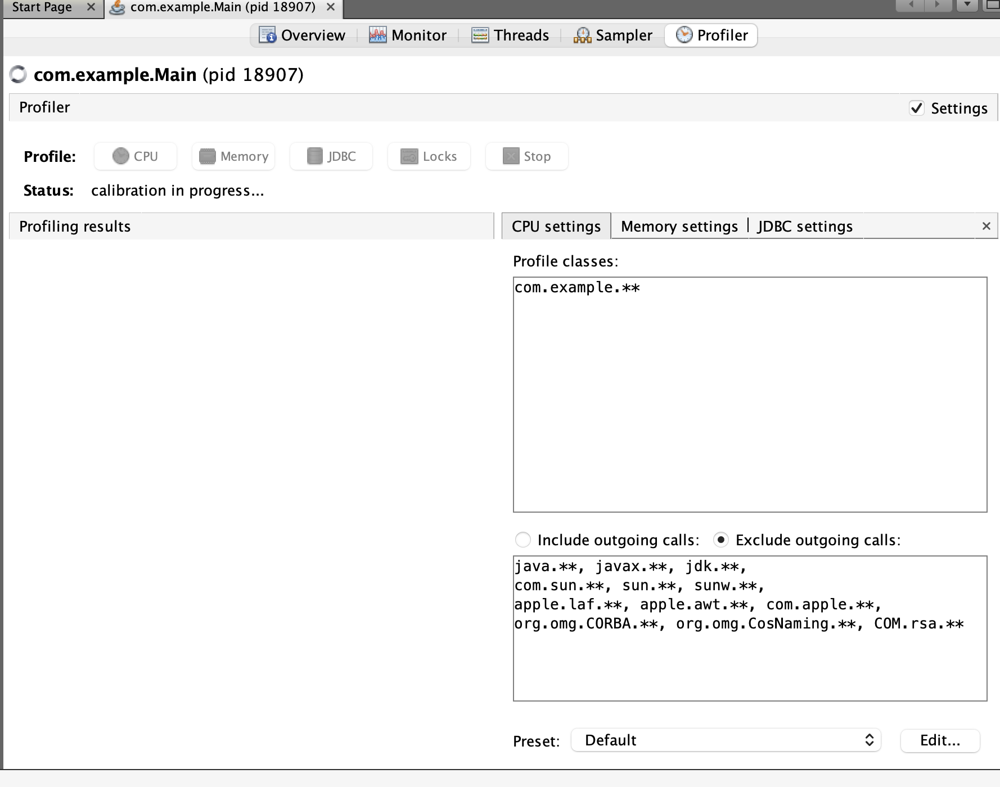
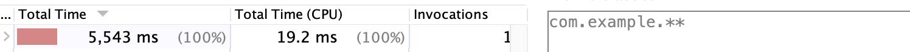

## 7.2 프로파일링으로 메서드의 실행 횟수 파악

- 로직을 정확히 이해하려면 더 자세한 정보가 필요한 경우도 있는 법이다.
- 앱을 한번 실행해서 50Ms밖에 안걸려도 1000번 실행하면 50초가 걸린다.
- 프로파일링 할 땐, 조사에서 꼭 필요한 부분만 하자, 리소스가 많이 소모되는 작업이므로, 샘플링부터 해본 후에 프로파일링 대상을 식별하는 것이 합리적이다.

1. 범위를 제한하자. 
2. 각 규칙마다 별도의 라인에 작성하자.
싱글 애스터리스크는 패키지를 가리킨다.
더블 애스터 리스크는 퍀미지와 하위 모두를 가리킨다.

**CPU 앱 프로파일링을 시작해보자**

- 프로파일링은 항상 적은 패키지를 대상으로 수행하자.
- 5초가 걸렸지만 1번밖에 실행되지않았다.

- 호출 횟수가 문제인 것 같지는 않다. 불필요한 반복이 되지는 않는다는거다.
- 어디서부터 어떻게 해결해야할지 알아내야한다.
