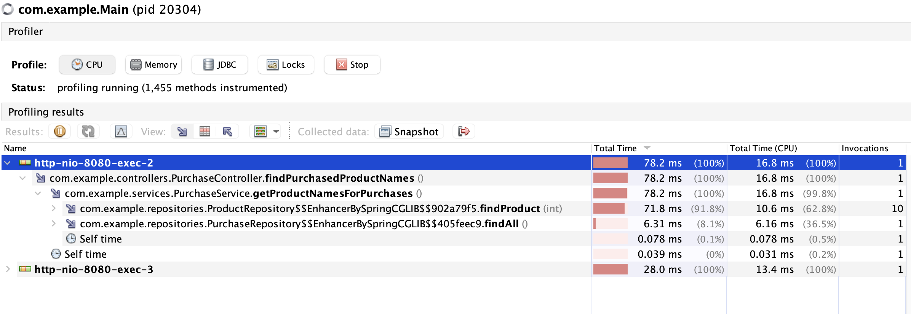
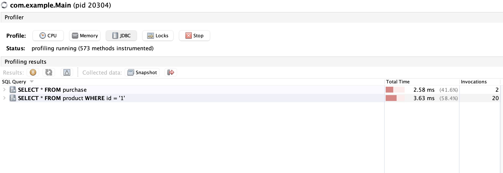
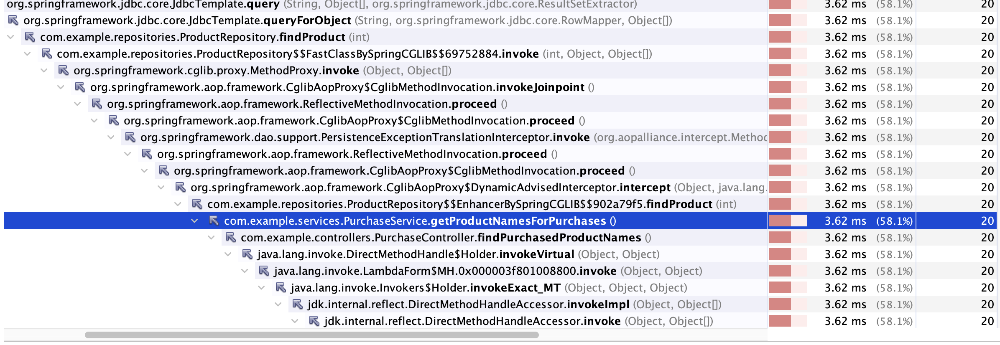
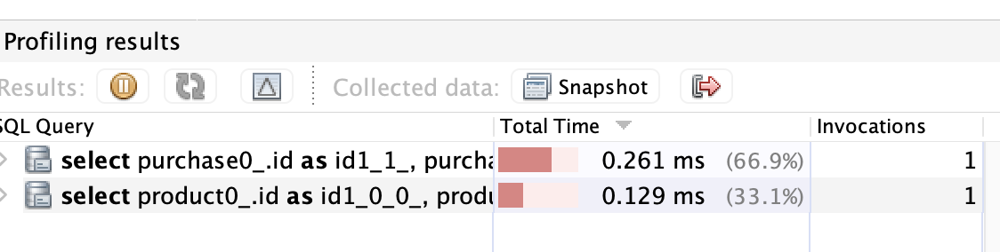

## 7.3 프로파일러로 앱이 실제로 실행하는 SQL파악

- 요즘 앱에는 적어도 하나 이상의 관계형 DB를 사용한다.
- 이번에는 퍼시스턴스 프레임워크 기반으로 작성되어 앱이 직접 쿼리를 처리하지 않을 때에도 실행된 SQL쿼리를 가져오는 방법을 배운다.

> 예제의 작은 앱은 2개뿐인 데이터에 인메모리 DB를 구성하고 각 테이블을 몇개의 레코드로 채우는 일을한다.
<br>예제의 엔드포인트를 실행하면 프로파일러의 진가가 드러난다.



중간에 보면 10번이나 실행된다. 코드의 설계가 잘못된걸까?

- 코드를 읽지도 않았는데 많은 정보를 알았다. 프로파일러는 클래스와 메서드명, 서로 호출하는 과정도 알려준다.

```java
package com.example.services;

import com.example.model.Product;
import com.example.model.Purchase;
import com.example.repositories.ProductRepository;
import com.example.repositories.PurchaseRepository;
import org.springframework.stereotype.Service;

import java.util.HashSet;
import java.util.List;
import java.util.Set;

@Service
public class PurchaseService {

  private final ProductRepository productRepository;
  private final PurchaseRepository purchaseRepository;

  public PurchaseService(ProductRepository productRepository,
                         PurchaseRepository purchaseRepository) {
    this.productRepository = productRepository;
    this.purchaseRepository = purchaseRepository;
  }

  public Set<String> getProductNamesForPurchases() {
    Set<String> productNames = new HashSet<>();
    List<Purchase> purchases = purchaseRepository.findAll();
    for (Purchase p : purchases) {
      Product product = productRepository.findProduct(p.getProduct());
      productNames.add(product.getName());
    }
    return productNames;
  }
}

```

1. DB에서 전체 구매 데이터를 가져온다.
2. 제품별로 루프를 반복한다.
3. 구매한 제품의 세부 정보를 조회한다.
4. 제품에 세트를 추가한다.
5. 제품 세트를 리턴한다.

- 문제점은 매번 DB를 들러서 많은 데이터를 가져온다는것이다. 예제는 프로파일링으로 알아보기쉽고 찾아내기 쉽지만
<br>프로파일링을 사용하지않으면 직접 쿼리를 찾아내는건 정말 어렵다.

> 프로파일러가 물밑에서 하는 일은 간단하다. 자바 앱은 JDBC 드라이버를 통해 SQL쿼리를 DB에 보낸다.
<br>프로파일러는 드라이버가 쿼리를 DB에 보내기전에 드라이버를 가로채서 쿼리를 복사한다.
<br>그러면 DB 클라이언트에 쿼리를 복사 후 붙여넣고 쿼리를 실행하거나, 실행 플랜을 확인할 수 있다.

- 프로파일러는 쿼리를 보낸 횟수도 알려준다. 



- 이렇게 정확히 개선점을 찾고 알아갈 수 있다.



이런식으로도 어디서 문제가 일어났는지 찾을 수 있다. 문제를 찾았으니 최적화 해보자.

```java
package com.example.repositories;

import com.example.model.Product;
import com.example.repositories.mappers.ProductRowMapper;
import org.springframework.jdbc.core.JdbcTemplate;
import org.springframework.stereotype.Repository;

@Repository
public class ProductRepository {

  private final JdbcTemplate jdbcTemplate;

  public ProductRepository(JdbcTemplate jdbcTemplate) {
    this.jdbcTemplate = jdbcTemplate;
  }

  public Product findProduct(int id) {
    String sql = "SELECT * FROM product WHERE id = ?";
    return jdbcTemplate.queryForObject(sql, new ProductRowMapper(), id);
  }
}
```

- 더 굉장한것을 볼 것이다. 레포지토리는 단순한 자바 인터페이스로 SQL쿼리는 찾아볼 수 없다. 스프링 데이터JPA를 쓰면 메서드명,<br>
또는 쿼리를 정의하는 정해진 방법에 따라 쿼리가 실행된다.
- JPQL은 앱의 객체에 기반한 퍼시스턴스 쿼리다. 코드에서 복붙할 수 없다.
- 프로파일러는 구세주이다. DB보내기전에 확실히 알아낼 수 있다. 



기존에는 10번이었지만, 최적화를 하니 1번이 됐다. 메서드는 동일하게 10번호출이되지만 말이다.
- SQL문도 그대로 볼 수 있다.

**N+1문제**
- 이 문제가 생기면 대부분의 개발자는 디버깅을 하고싶어하는 충동이 드는거 같다. 좋은 방법이 아니다.
- 로그를 사용하면 어떤 쿼리가 문제인지 식별하기 어렵다 실제 시나리오에서 앱은 온갖 쿼리를 전송하는데, <br>그중에는 여러번 DB전송되는 것들도 있을테고, 쿼리가 길고 매개 변수가 많은 편이다. 프로파일러를 사용하면 거의 바로 문제점을 찾을 수 있다.

### 프로파일러로 프로그램에서 생성된 SQL쿼리 식별
- 하이버네이트에서, 퍼시스턴스 레이어를 프로그래밍으로 정의하려면, 크라이테리어 쿼리를 사용한다.

```java
package com.example.repositories;

import com.example.entities.Product;
import org.springframework.stereotype.Repository;

import javax.persistence.EntityManager;
import javax.persistence.TypedQuery;
import javax.persistence.criteria.CriteriaBuilder;
import javax.persistence.criteria.CriteriaQuery;
import javax.persistence.criteria.Predicate;
import javax.persistence.criteria.Root;

@Repository
public class ProductRepository {

  private final EntityManager entityManager;

  public ProductRepository(EntityManager entityManager) {
    this.entityManager = entityManager;
  }

  public Product findById(int id) {
    CriteriaBuilder cb = entityManager.getCriteriaBuilder();
    CriteriaQuery<Product> cq = cb.createQuery(Product.class);

    Root<Product> product = cq.from(Product.class);
    cq.select(product);

    Predicate idPredicate = cb.equal(cq.from(Product.class).get("id"), id);
    //Predicate idPredicate = cb.equal(product.get("id"), id);
    cq.where(idPredicate);

    TypedQuery<Product> query = entityManager.createQuery(cq);
    return query.getSingleResult();
  }
}

```

여기서 문제점을 찾아보자. JDBC드라이버를 프로파일링을 하면 간단하다.<br>
이 코드의 문제는 자기자신에게 계속 셀프조인을 하고있다. 결국 잘못된 아웃풋을 줄것이다.

```java
package com.example.repositories;

import com.example.entities.Product;
import org.springframework.stereotype.Repository;

import javax.persistence.EntityManager;
import javax.persistence.TypedQuery;
import javax.persistence.criteria.CriteriaBuilder;
import javax.persistence.criteria.CriteriaQuery;
import javax.persistence.criteria.Predicate;
import javax.persistence.criteria.Root;

@Repository
public class ProductRepository {

  private final EntityManager entityManager;

  public ProductRepository(EntityManager entityManager) {
    this.entityManager = entityManager;
  }

  public Product findById(int id) {
    CriteriaBuilder cb = entityManager.getCriteriaBuilder();
    CriteriaQuery<Product> cq = cb.createQuery(Product.class);

    Root<Product> product = cq.from(Product.class);
    cq.select(product);

    //Predicate idPredicate = cb.equal(cq.from(Product.class).get("id"), id);
    Predicate idPredicate = cb.equal(product.get("id"), id);
    cq.where(idPredicate);

    TypedQuery<Product> query = entityManager.createQuery(cq);
    return query.getSingleResult();
  }
}

```

이렇게 고친다면 크로스 조인이 사라져 쿼리가 한결 빨라진 걸 볼 수 있다.

### 실행되는 코드, 각 메서드의 총 실행 시간, CPU의 실행시간, 쿼리등을 잘 볼 수 있다.