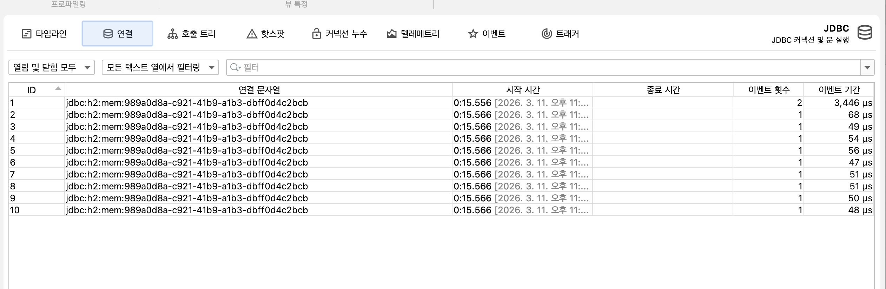

## JDBC 접속 문제 감지

쿼리를 보내려는 앱이 DB커넥션을 맺을 때 부터 문제가 생기면 어떻게 대처해야할까?

- 요즘 개발자는 자동화에 의존하기 때문에 적잖이 발생한다.

스프링이 트랜잭션을 관리하는 표준 메서드 실행 모드에서 제일 마지막에 커넥션을 닫는다.
<br>하지만 스프링 배치의 배치모드에서 프로시저를 취소하는 경우 알아서 닫아주지않아서 개발자가 직접 챙겨야한다.

어떤 프레임워크를 사용하든 백그라운드에서 모든 일이 일어나는지 전부 알 수 없다. 조사할 준비를 해두어야한다.

- 8번 예제는 제품의 상세 정보를 리턴하는데 엔드포인트를 처음 호출하면 거의 즉시 응답이 돌아오지만, 두번째부턴 에러를 호출한다.

> 책에는 상당히 친절하게 사진이 걸려있지만. 그릴 자신이 없어서 그냥 읽기만 한다.

대충 내용은 
1. 처음 실행 두번째 실행은 DBMS가 친절하게 커넥션을 맺어주지만 100번째, 어느정도 갔을경우 너무 많이 맺어 맺어주지않는다.

DB에 접속 가능한 커넥션 수는 정해져있다. 이 한도를 초과하면 DB앱이 커넥션을 맺지 못하게 차단하며, 앱은 더이상 정상 작동 하지 않을것이다.

예제도 처음에는 바로 호출되지만, 두번째부터는 불러도 30초 이따가 에러메시지 응답만 할 뿐이다.

```java
java.sql.SQLTransientConnectionException: HikariPool-1 - Connection is not available, request timed out after 30002ms.
	at com.zaxxer.hikari.pool.HikariPool.createTimeoutException(HikariPool.java:696)
	at com.zaxxer.hikari.pool.HikariPool.getConnection(HikariPool.java:197)
	at com.zaxxer.hikari.pool.HikariPool.getConnection(HikariPool.java:162)
	at com.zaxxer.hikari.HikariDataSource.getConnection(HikariDataSource.java:128)
	at com.example.repositories.PurchaseRepository.findAll(PurchaseRepository.java:31)
	at com.example.repositories.PurchaseRepository$$FastClassBySpringCGLIB$$d661c9a0.
```

대충 뭐 이런 메시지다. 
- 항상 프로파일링부터 , 샘플링부터 하는것이 좋다. 예제에서 getConnetion이라는 오류가 뜨는데 나는 뜨지않는다.

나는 **JProfiler를 사용할것이다**

여기서 누수와, 커넥션의 오류를 볼건데 결과는 이렇다.



- 앱이 응답 후에도 닫히지 않은 채 그대로 남았다. 지금은 CPU 프로파일링을 하지않아서 커넥션을 생성한 스레드명만 확인할 수 있다. 
- 스레드만 봐도 충분할 때가 많은데, 굳이 CPU프로파일링을 하지않아도 된다. 하지만 지금같은 상황에서 커넥션을 생성한 코드를 찾아내기에는 정보가 부족하다. 지금부터 잊어버린 코드가 어느 부분인지 찾아보겠다.

계속 켜두며 작업을 하다가 맥북에 무리가 가서, 실습은 종료하고 글로 적겠다. 아무래도 CPU를 계속 다루다 보니 부하가 걸린 거 같다. 대충 이렇게 하면 트레이스 로그를 볼 수 있는데, 여기서 어느 커넥션 리크를 일으켰는지 볼 수 있다.

```java
  public Product findProduct(int id) throws SQLException {
    String sql = "SELECT * FROM product WHERE id = ?";

    Connection con = dataSource.getConnection();
    try (PreparedStatement statement = con.prepareStatement(sql)) {
      statement.setInt(1, id);
      ResultSet result = statement.executeQuery();

      if (result.next()) {
        Product p = new Product();
        p.setId(result.getInt("id"));
        p.setName(result.getString("name"));
        return p;
      }
    }
    return null;
  }
```
이 부분이 문제다. getConnection 을 try문 안에 넣어주면 된다.
<br>이렇게 하면 문제는 해결되고 올바르게 하나만 떠있게 된다.